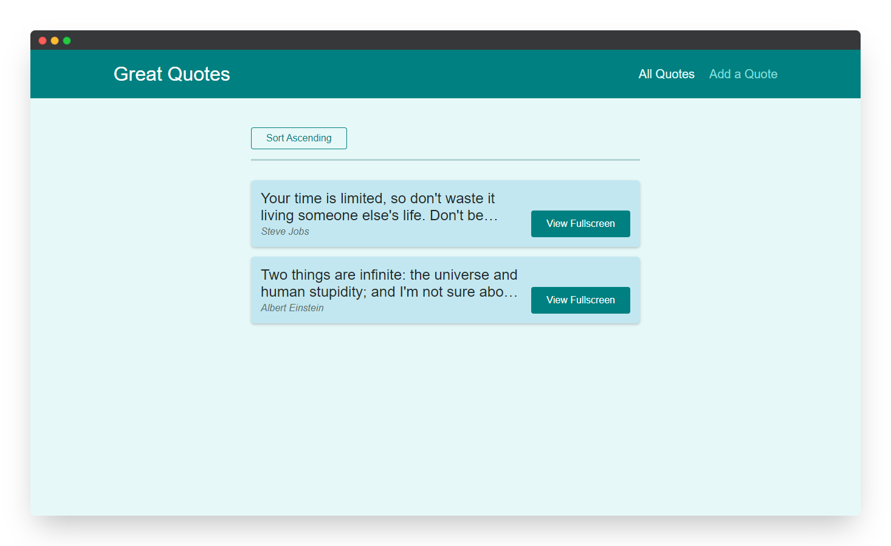
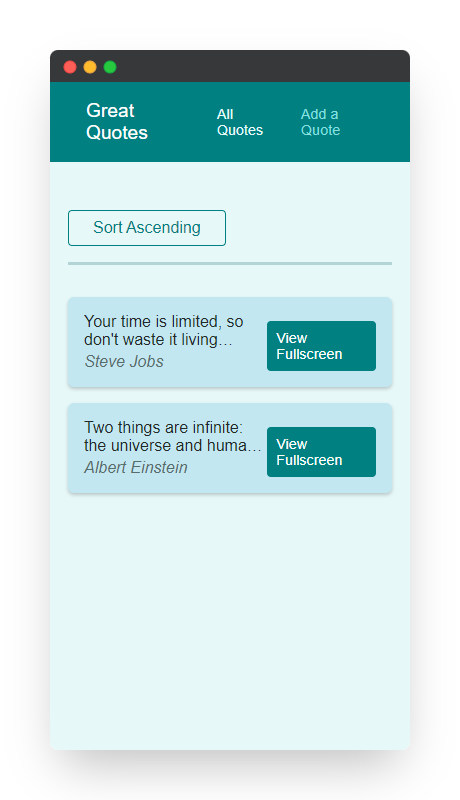
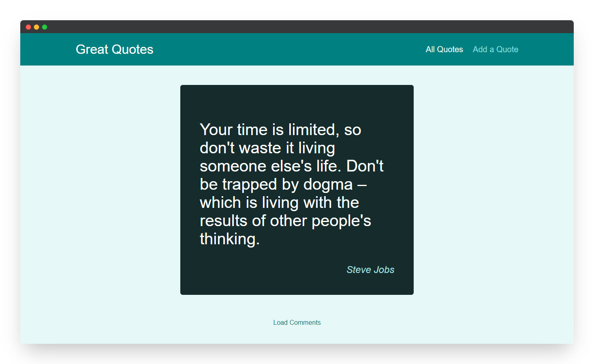
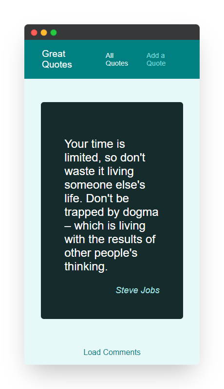
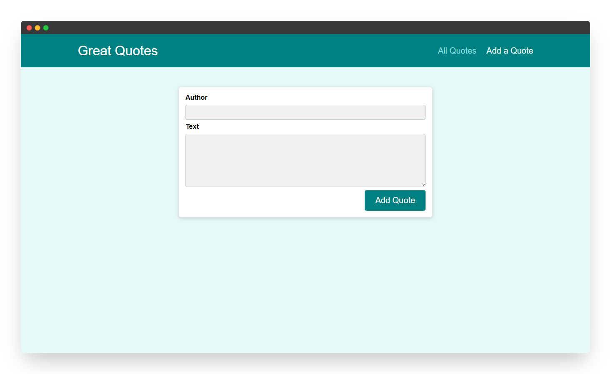
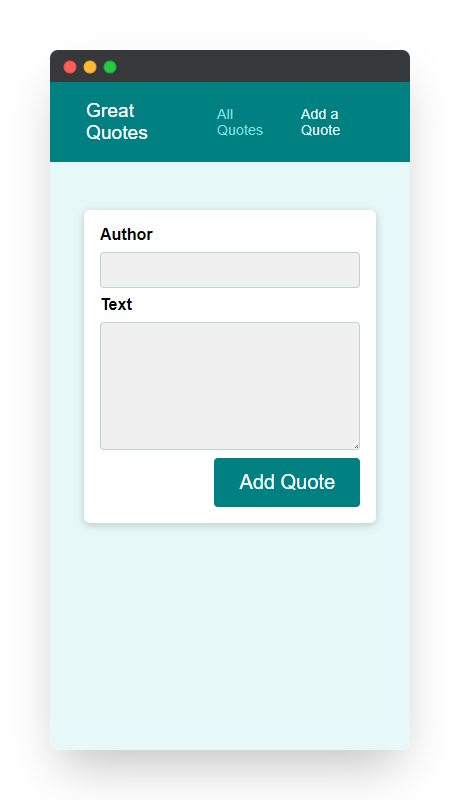
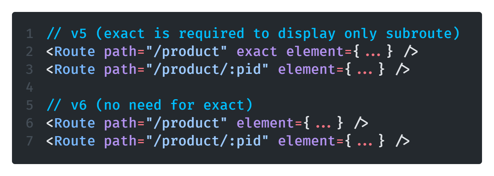

<!--
*** Thanks for checking out the react-router-demo. If you have a suggestion
*** that would make this better, please fork the repo and create a pull request
*** or simply open an issue with the tag "enhancement".
*** Thanks again! Now go create something AMAZING! :D
***
*** To avoid retyping too much info. Do a search and replace for the following:
*** github_username (that is "windsuzu"), repo_name (that is "react-router-demo"), project_title, project_description
-->

<!-- [![Issues][issues-shield]][issues-url] -->
<!-- [![PR Welcome][pr-welcome-shield]](#contributing) -->
[![Contributors][contributors-shield]][contributors-url]
[![MIT License][license-shield]][license-url]
[![Author][author-shield]][author-url]
[![LinkedIn][linkedin-shield]][linkedin-url]

<!-- PROJECT LOGO -->
 

  

  <h3 align="center">React Redux Demo</h3>

  

    A comprehensive demo showing the use of react-router-dom v6.
     
    <a href="https://windsuzu.github.io/react-router-demo">View Demo</a>
    ·
    <a href="https://github.com/windsuzu/react-router-demo/issues">Report Bug</a>
    ·
    <a href="https://github.com/windsuzu/react-router-demo/issues">Request Feature</a>
  

Table of Contents

* [About](#about)
* [Difference between v5 and v6](#difference-between-v5-and-v6)
  * [❤️ Browser Router](#️-browser-router)
  * [❤️ Routes and Route Components](#️-routes-and-route-components)
  * [❤️ Display Subroute](#️-display-subroute)
  * [❤️ NavLink Active Status](#️-navlink-active-status)
  * [❤️ useParams](#️-useparams)
  * [❤️ Redirect => Navigate](#️-redirect--navigate)
  * [❤️ Route inside Components](#️-route-inside-components)
  * [🎆 Outlet (v6 only)](#-outlet-v6-only)
  * [❤️ Imperative Navigation](#️-imperative-navigation)
* [Examples](#examples)
* [Preview](#preview)
* [License](#license)
* [Contact](#contact)
* [Acknowledgements](#acknowledgements)

---

<!-- ABOUT THE PROJECT -->
## About

這個專案主要展示如何使用 `react-router-dom@v6` 讓一個 SPA (Single-Page Application) 專案能夠自由控制 url 與頁面轉換。

另外，下方的 [[Difference between v5 and v6]](#difference-between-v5-and-v6) 區塊也整理了 react-router-dom 的 v5 和 v6 差別。

<table>
<tr>
<td>

**Built With**

* HTML5, CSS3, Javascript ES6
* React.js + Redux
* react-router-dom@v6

**[DEMO]** : https://windsuzu.github.io/react-router-demo

</td>
</tr>
</table>

---

## Examples

### 🪃 Setup Routes

* [setup `<BrowserRouter>`](https://github.com/windsuzu/react-router-demo/blob/main/src/index.js#L8-L10)
* [setup `<Routes>` and `element`](https://github.com/windsuzu/react-router-demo/blob/main/src/App.js#L11-L17)
* [setup NotFound page](https://github.com/windsuzu/react-router-demo/blob/main/src/App.js#L16)

### ⚔️ Nested Routes

* [setup route with `*`](https://github.com/windsuzu/react-router-demo/blob/main/src/App.js#L14)
* [implement `<Routes>` in components](https://github.com/windsuzu/react-router-demo/blob/main/src/pages/QuoteDetail.js#L41-L53)

### 🗡️ Using Links and NavLinks

* [Link](https://github.com/windsuzu/react-router-demo/blob/main/src/components/quotes/QuoteItem.js#L63-L65)
* [NavLink with `active style`](https://github.com/windsuzu/react-router-demo/blob/main/src/components/layout/MainNavigation.js#L57-L62)

### 🛡️ Extracting URL Params (useLocation, useParams)

* [use `url search params` to replace `states`](https://github.com/windsuzu/react-router-demo/blob/main/src/components/quotes/QuoteList.js#L33-L40)
* [use `url params` to replace `props`](https://github.com/windsuzu/react-router-demo/blob/main/src/pages/QuoteDetail.js#L17-L21)

### 🩸 Redirect, Navigation, Imperative Navigation

* [use `<Navigate replace>` to redirect users](https://github.com/windsuzu/react-router-demo/blob/main/src/App.js#L12)
* [use `useNavigate` to redirect users](https://github.com/windsuzu/react-router-demo/blob/main/src/pages/NewQuote.js#L9-L15)
* [push `url` to change `states`](https://github.com/windsuzu/react-router-demo/blob/main/src/components/quotes/QuoteList.js#L42-L44)

## Preview

  
  
  
  
  
  

---

## Difference between v5 and v6

### ❤️ Browser Router

### ❤️ Routes and Route Components

### ❤️ Display Subroute

### ❤️ NavLink Active Status

### ❤️ useParams

### ❤️ Redirect => Navigate

### ❤️ Route inside Components

### 🎆 Outlet (v6 only)

### ❤️ Imperative Navigation

## License

Distributed under the MIT License. See [LICENSE](https://github.com/windsuzu/react-router-demo/blob/main/LICENSE) for more information.

## Contact

Reach out to the maintainer at one of the following places:

* [GitHub discussions](https://github.com/windsuzu/react-router-demo/discussions)
* The email which is located [in GitHub profile](https://github.com/windsuzu)

## Acknowledgements

* [Maximilian Schwarzmüller](https://www.udemy.com/user/maximilian-schwarzmuller/)

[contributors-shield]: https://img.shields.io/github/contributors/windsuzu/react-router-demo.svg?style=for-the-badge
[contributors-url]: https://github.com/windsuzu/react-router-demo/graphs/contributors
[issues-shield]: https://img.shields.io/github/issues/windsuzu/react-router-demo.svg?style=for-the-badge
[issues-url]: https://github.com/windsuzu/react-router-demo/issues
[license-shield]: https://img.shields.io/github/license/windsuzu/react-router-demo.svg?style=for-the-badge&label=license
[license-url]: https://github.com/windsuzu/react-router-demo/blob/main/LICENSE
[linkedin-shield]: https://img.shields.io/badge/-LinkedIn-black.svg?style=for-the-badge&logo=linkedin&colorB=555
[linkedin-url]: https://linkedin.com/in/windsuzu
[pr-welcome-shield]: https://shields.io/badge/PRs-Welcome-ff69b4?style=for-the-badge
[author-shield]: https://shields.io/badge/Made_with_%E2%9D%A4_by-windsuzu-F4A92F?style=for-the-badge
[author-url]: https://github.com/windsuzu
